<p align="center">
  
</p>

Open a separate Basiliskos-owned Claude Code Windows app and switch the
authorized account serving it: Claude, Codex, Grok Build, or Kimi Code. Your normal Claude
app remains untouched.

Inside that isolated window, Basiliskos keeps the selected real engine visible
in the model chip, for example `Grok 4.5`, while the assistant reports the
actual upstream route directly. Basiliskos also adds a truthful route-aware
identity instruction to proxied requests using each provider's canonical
instruction field, so model self-reports use the selected upstream route while
still disclosing the real backend when asked.

Basiliskos is a local Windows controller around a pinned CLIProxyAPI runtime.
It uses Claude Desktop's supported third-party gateway configuration and each
provider's official browser OAuth flow. It does not patch Claude, bypass usage
limits, or automate approval pages.

## How it works

<p align="center">
  
</p>

Basiliskos launches the installed Claude app with `CLAUDE_USER_DATA_DIR`
pointed at `~/.hydra-gateway/claude-profile`. This gives Basiliskos a separate
Electron process, cookies, sessions, and configuration. Basiliskos enables
exactly one local credential file. Claude Code receives the valid
Anthropic-shaped gateway configuration it requires; the loopback front proxy
rewrites each request to the selected provider's real model ID and appends a
truthful route identity before CLIProxyAPI forwards it upstream. The user-facing
label shows the selected model, and model/thinking changes apply on the next
request.

## First use

1. Open Basiliskos. Its local proxy starts automatically.
2. Choose **Claude**, **Codex**, **Grok**, or **Kimi**, then select **Add account**.
3. Basiliskos opens the provider's validated HTTPS OAuth URL in your default
   browser. Kimi also shows its one-time device code. Finish the official login
   there.
4. Basiliskos automatically opens its own isolated Claude window after an
   account is selected. You can also choose **Open Basiliskos Claude**.
5. Use **Use account** whenever you want to change the backend underneath the
   Basiliskos-owned window.
6. Choose the real **Model** and **Thinking** level in **Basiliskos route**.
   Basiliskos exposes only the thinking levels supported by that model; the
   control is disabled when the model manages thinking itself.
7. The account list shows remaining usage for every supported provider,
   including Kimi Code's weekly and rolling quota windows when Kimi returns
   them. If a signed-in Kimi account has no Kimi Code subscription, the
   account card shows **No active Kimi Code subscription** instead of a
   misleading re-auth error.

Basiliskos never applies its relay to `%LOCALAPPDATA%\Claude-3p`. Version 1.0.1
also detects and restores a shared configuration left applied by version 1.0.0.

## Local data and security

- Controller state: `~/.hydra-gateway`
- Provider credentials: `~/.hydra-gateway/gateway/auth`
- Isolated Claude profile: `~/.hydra-gateway/claude-profile`
- Relay binding: loopback only (`127.0.0.1`)
- Relay API: protected by a generated local key
- Management API and web control panel: disabled
- Credentials and keys are not logged or committed
- The normal Claude process, profile, and Claude Code CLI are never terminated

Use Basiliskos only with accounts you own or are authorized to access.
Switching accounts changes which subscription is selected; it does not remove
or evade provider limits.

## Build and test

Requirements: Node.js 18+, pnpm, Rust, and Visual Studio Build Tools 2022 with
Desktop development with C++.

```powershell
pnpm install
pnpm test:all
pnpm bundle
```

`prepare-gateway.ps1` downloads CLIProxyAPI v7.2.77 at build time and verifies
both the release archive and executable SHA-256 before bundling it. The binary
is not committed to Git. See [THIRD_PARTY_NOTICES.md](THIRD_PARTY_NOTICES.md).

The canonical per-machine NSIS installer is written to
`src-tauri/target/release/bundle/nsis/`. Authenticode signing is optional:
CI signs when certificate secrets are configured; otherwise it produces an
explicitly unsigned installer with SHA-256, SBOM, provenance, and lifecycle
evidence. Windows will show `Unknown publisher` for unsigned installers.

## Independence

This fork is isolated from `../grok-hydra`; the original project remains
unchanged. Basiliskos is MIT licensed and is not affiliated with Anthropic,
OpenAI, xAI, Moonshot AI, or CLIProxyAPI.

## Support

Basiliskos is free and open source. Optional tips:
[ko-fi.com/3readyproto](https://ko-fi.com/3readyproto).
